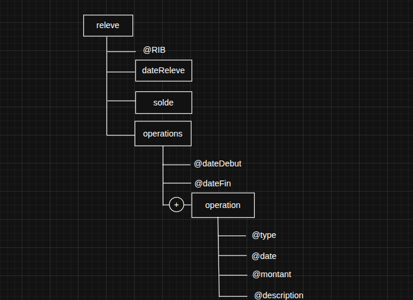
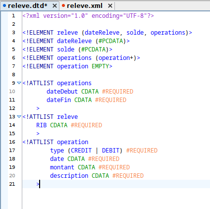
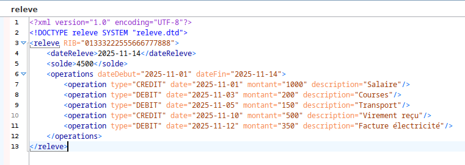
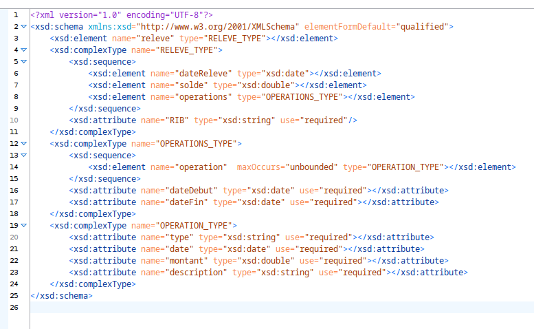
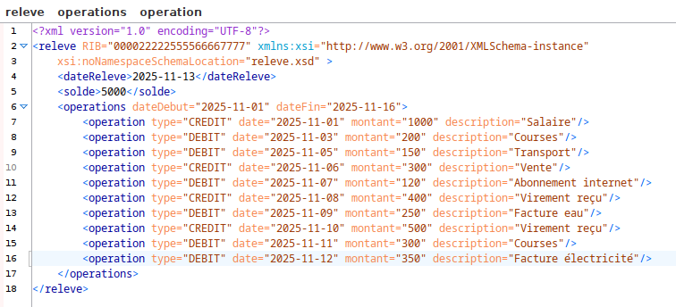
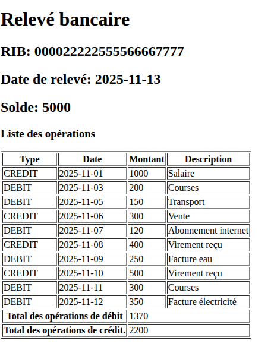
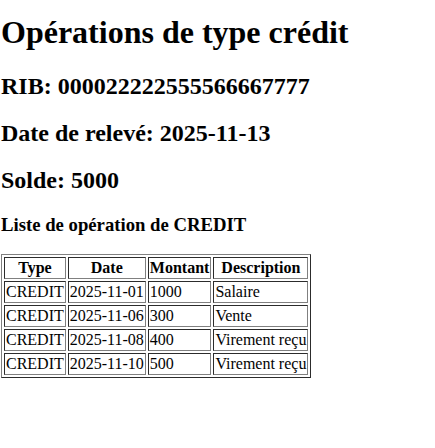

<h1>Objectifs: Manipulation de XML, DTD, XSD et XSLT</h1>

Dans ce projet, nous allons utiliser les technologies XML, DTD, XSD et XSLT afin de modéliser, valider et présenter sous forme lisible les données issues d’un relevé bancaire.

<h2>1. Utilisation de la structure graphique de l’arbre XML</h2>

<h2>2. Utilisation d’un DTD pour la validation du document XML</h2>
<h2>- DTD :</h2>

<h2>- Document XML:</h2>

<h2>3. Utilisation d’un schéma XML (XSD)</h2>
<h2>- schéma XML</h2>

<h2>- Document XML</h2>

<h2>4. Utilisation d’une feuille de style XSL pour l’affichage HTML global</h2>

Nous allons utiliser une feuille de style XSL pour :
<ul>
<li>
Afficher toutes les données du document XML au format HTML</li>
<li>Calculer et afficher :
<ol>
<li>Le total des opérations de débit</li>
<li>Le total des opérations de crédit</li>
</ol>
</li>
</ul>

<h2>5. Utilisation d’une feuille de style XSL pour l’affichage des opérations de crédit.</h2>

Nous allons utiliser une deuxième feuille de style XSL afin d’afficher uniquement les opérations de type CREDIT d’un relevé bancaire au format HTML.

